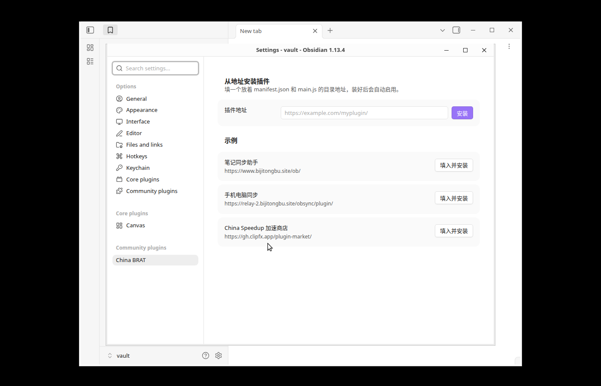

# China BRAT

An Obsidian plugin that installs another plugin **from a plain URL**. Inspired by
[BRAT](https://github.com/TfTHacker/obsidian42-brat), it does one thing only: fetch a plugin's
files from a directory URL and enable it — and it deliberately **does not use zip archives**.
If the host serves the files under their own paths, the client is just three GET requests and
needs no decompression code at all.

The build is **~3 KB** (about 1.8 KB gzipped) with no `styles.css`, so the very first install
still goes through on a slow connection.



## Usage

Settings → Community plugins → **China BRAT**:

1. Paste a **directory URL** that hosts the target plugin's `manifest.json` and `main.js`
   (`styles.css` is optional), e.g. `https://example.com/myplugin/`.
2. Press **Install**. The files are written to `.obsidian/plugins/<id>/`, then the plugin is
   loaded and enabled.

Pasting the `.../manifest.json` URL works too — the file name is stripped and the parent
directory is used.

Three example endpoints are built in; one click fills the field and installs:

| Add-on | URL |
| --- | --- |
| 笔记同步助手 (Note Sync Helper) | `https://www.bijitongbu.site/ob/` |
| 手机电脑同步 (Phone/Desktop Sync) | `https://relay-2.bijitongbu.site/obsync/plugin/` |
| China Speedup | `https://gh.clipfx.app/plugin-market/` |

**HTTPS only** (`localhost` excepted). Installing code is executing code, and plain HTTP can be
swapped out by anyone on the same network.

## Why not zip

A zip path would need a decompression implementation inside the plugin — roughly a third of the
bundle — plus a dependency on `DecompressionStream`. When the host lays the three files out by
path (which the three example endpoints already do, since that is how their own updaters work),
the client shrinks to three GETs: smaller, compatible with older runtimes, and each file is
cached separately by the CDN. The trade-off is that **the host has to serve unpacked files**;
a ready-made zip link cannot be installed.

## What is validated before anything is written

- The URL must be HTTPS (plain HTTP is allowed for `localhost` during development).
- `manifest.json` must parse and carry a valid `id` and `version`. The `id` becomes part of the
  path on disk, so only `[A-Za-z0-9_.-]` is accepted and it may not start with `.`.
- A `minAppVersion` newer than the running app aborts the install, so a working copy is never
  overwritten with one that cannot load.
- `main.js` may not be empty.
- `styles.css` counts as "this add-on has no stylesheet" only on a real 404/410, in which case a
  leftover stylesheet from the previous version is removed; 500/403 raise an error instead, so a
  flaky network cannot delete a working stylesheet.
- After writing, the install is confirmed to have actually loaded. If it did not, an error is
  shown rather than a false success.

## Network use and privacy

- The only network requests are `GET` requests to the URL you type in (or to one of the three
  example URLs when you press their button), for `manifest.json`, `main.js` and `styles.css`.
- Nothing is uploaded, there is no telemetry, no account, and no paid feature.
- The three preset URLs are the public update endpoints of three add-ons written by the same
  author; they are shown as one-click examples and are never contacted unless you press the
  button.

## A note for reviewers

Obsidian exposes no public API for writing an add-on to disk and enabling it, so — like
[BRAT](https://github.com/TfTHacker/obsidian42-brat) — this plugin uses `app.plugins`
(`loadManifests`, `disablePlugin`, `enablePluginAndSave`, `plugins`). Those four members are the
only undocumented API used; everything else is public API (`requestUrl`, `Vault.adapter`,
`requireApiVersion`, `Notice`, `Setting`). There is no self-update mechanism: this plugin never
downloads or replaces its own `main.js`, and when the URL you enter happens to point at this
plugin's own id it writes the files and asks you to restart rather than hot-swapping itself.

## Development

```bash
npm install
npm run lint       # eslint-plugin-obsidianmd — the same static scan the review bot runs
npm run build      # emits main.js (runs tsc first)
```

## Installing this plugin

Copy `main.js` and `manifest.json` from [Releases](../../releases) into
`<vault>/.obsidian/plugins/chinabrat/`, restart Obsidian, and enable it under community plugins.
Release assets are built by GitHub Actions and carry
[build provenance attestations](https://docs.github.com/actions/security-guides/using-artifact-attestations-to-establish-provenance-for-builds),
so you can verify them with:

```bash
gh attestation verify main.js --repo notesynchelper/chinabrat
```

## License

MIT

---

## 中文说明

**粘一个地址就能装插件。** 灵感来自 BRAT，但只做「从直链装一个插件」这一件事，并且刻意
**不走 zip**——源站把插件文件按路径摊开放，客户端就退化成三个 GET，不用带任何解压代码。
产物 3 KB 出头（gzip 后约 1.8 KB），没有 `styles.css`，第一次装的时候网络差也拉得下来。

### 用法

设置 → 第三方插件 → **China BRAT**：

1. 在「插件地址」里填一个**目录地址**，该目录下放着要装的插件的 `manifest.json` 和
   `main.js`（`styles.css` 可选），例如 `https://example.com/myplugin/`；
2. 点「安装」。文件写进 `.obsidian/plugins/<插件 id>/`，然后自动加载并启用。

直接粘 `.../manifest.json` 也行，会自动去掉文件名当目录用。设置页内置三个示例地址，点
「填入并安装」一键装上（笔记同步助手 / 手机电脑同步 / China Speedup 加速商店）。

**只接受 https**（`localhost` 除外）：装插件等于执行代码，明文 http 会被同网段的人掉包。

### 为什么不是 zip

zip 方案得在插件里塞一份解压实现，约占体积的三分之一，还要依赖 `DecompressionStream`。
只要源站把三个文件摊开放（上面三个示例的自更新端点本来就是这么放的），客户端就只剩三个
GET：体积更小、老版本也能跑、每个文件还能被 CDN 分别缓存。代价是**源站要配合摊开文件**，
拿到一个现成 zip 链接是装不了的。

### 装了会做什么检查

- 地址必须是 https（本机开发放行 http）
- `manifest.json` 必须能解析，且 `id` / `version` 合法；`id` 会拼进写盘路径，所以只允许
  `[A-Za-z0-9_.-]` 且不能以 `.` 开头
- `minAppVersion` 高于当前 Obsidian 就拒绝写盘（不会把能用的版本覆盖成装不上的）
- `main.js` 不能是空的
- `styles.css` 只有真的 404/410 才当作「这个插件没有样式」，此时会顺手删掉上一版残留的旧样式；
  500/403 一律报错，免得网络抖动把已装好的样式删了
- 装完确认 Obsidian 真的加载起来了，没加载起来就报错，不会假报成功
